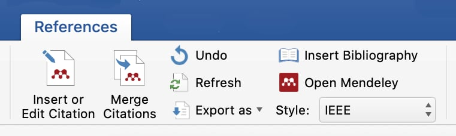

# Adding citations

You can use the Desktop add-in or Mendeley Cite to add citations to Word, but you can't use both tools in the same document. Experiment to see which suits you best before starting a project.

## Using Mendeley Desktop tools

The Desktop add-in tools are part of the **References** ribbon in Word, and have the Mendeley logo.

<figure>

<figcaption>
Mendeley Desktop's citation tools for Word in macOS
</figcaption>
</figure>

?> Some older versions of Word may have a separate Mendeley toolbar.

### Search for citations

Searching is the fastest way to add a citation.

First, move the cursor to the location you want to add your citation.

Open the **References** ribbon and click **Insert Citation**. A search box will appear. Type in a search term related to the output you want to cite - for example, the author's surname or a phrase from the title.

Search results will appear as you type. When you see the item you want to cite, either click it or select it using the arrow keys and hit return.

The window will preview the citation you're about to add (e.g. **Smith 2019**). At this stage you can set options for the citation (see below), or click **OK** to add the citation as-is.

You'll be taken back to Word, and after a moment the citation will appear in your document.

### Browse for citations

You can also add a citation by browsing your library in Mendeley Desktop. You may prefer this if you like to organise your library using folders.

Move your cursor to where you want to create your citation, open the References ribbon and click **Insert Citation** in the Mendeley section.

The search window will appear. Click the **Go to Mendeley** button and you'll be taken to Mendeley Desktop.

Browse to the item you want to add in Desktop, select it, and click the **Cite** button in the toolbar.

You'll be taken back to Word, where the search box will show your selected citation. You can now add citation options (see below) or click **OK** to add the citation as-is.

## Using Mendeley Cite

Mendeley Cite opens next to your document, so you can cite as you type.

Launch Cite from the **References** ribbon. It's usually found at the right-hand end of the ribbon. You may need to log in using your Mendeley account details.

Cite will show a list of your library items with a search box at the top. Make sure your cursor is in the right place and then search for your citation in the Cite window.

Tick the citation you want to add and then click **Insert 1 citation** to add the item to Word.
