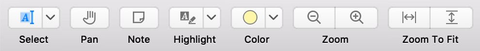

# PDF features

Mendeley has some useful tools for working with PDFs in your library. Many of these are available in the Web Library, available from any browser, but some can only be used in Mendeley Desktop.

## Reading PDFs

If you've added a document as a PDF, you'll see the red and white PDF icon to the left of the title in your library.

Click the icon to open the PDF in a new tab inside Mendeley Desktop. The citation details will open to the right of the PDF for editing or adding information.

?> If you don't see the citation details, they're probably hidden. Use **View > Show Document Details** to bring them back. You can also use **Alt & Return** on the keyboard, or click the small arrow to the right of the scrollbar.

When you're reading a PDF you'll see some new buttons in the toolbar to help you navigate and make notes in the document.

<figure>

<figcaption>
PDF tools in Mendeley Desktop
</figcaption>
</figure>

## Selecting text

The **Select** button will let you highlight text in the PDF for copying.

!> Some PDFs may not support selecting text. This is a limitation of the PDF file, rather then Mendeley.

The default selection tool is **Select Text**, which gives you a standard selection cursor. You can use the arrow next to the tool to change this to **Select Rectangle**, which is useful if you want to select a column of text in a table.

## Highlighting

After selecting a range of text you'll see a pop-up tool appear. Click the highlighter icon to highlight the selected text.

You can also click the **Highlight** button in the toolbar to highlight selected text, or to switch to a dedicated highlighter tool (like the text tool, this also has a rectangle option).

Highlights will be saved to your PDF so you can view them later. To remove a highlight, click it and select the trash icon from the pop-up menu.

To change the colour of a highlighted section, click it and use the drop-down colour tool. You can change the colour again later. If you're using the highlighter tool, you can change the active colour using the arrow next to the toolbar button.

## Notes

Mendeley has powerful note tools. There are two types of note:

### General notes

Every citation in your library has a **General Notes** field, even if there's no PDF attached. This is found in the **Document Details** view to the right of your library - just click the **Notes** tab.

?> General notes are useful because they're included in searches.

### Sticky notes

You can also add sticky notes to PDFs. Open a PDF and click the **Note** button in the toolbar, then click anywhere on the PDF to add a note. The new note will open for editing and you can start typing straight away.

To stop editing, use the **Esc** key or just click anywhere else on the PDF.

When you close a note, it will be replaced by a small placeholder in the note's colour. Click this to open the note again.

You can change the note's colour using the drop-down tool in the top left corner of the note.

In the top right corner of the note you'll see a trash icon to remove the note.

?> You can add a note to text you've already highlighted - use the **Select** tool, click the highlighted text and then click the pop-up note icon.

### Browsing sticky notes

Click the **Notes** tab in the Document Details view on the right to see a list of all sticky notes in the PDF you're viewing.. Click a note to jump to its location in the PDF.

?> This is a great way to bookmark sections of a PDF for quick access later.

## Online notes

All your highlights and sticky notes are saved online when you click the **Sync** button. This means that if you don't have access to your main laptop or PC, you can view your PDFs and notes from your [web library](https://mendeley.com/library) in any browser.

You can also add highlights and notes using the PDF viewer in your web library. They'll be added to your Mendeley Desktop PDFs next time you sync.

## Exporting notes

Mendeley doesn't add annotations to the PDF file saved on your computer - they only appear within Mendeley Desktop and your online library.

If you want to share a copy of a PDF with your notes included, select the citation in Mendeley Desktop and go to **File > Export PDF(s) With Annotations...**.

You'll be asked where to save the PDF (this will be your Downloads folder by default). There are also some export options. If **PDF** is ticked, the original PDF content will be included, and if **Notes** and **Highlights** are ticked, your annotations will be added.

If you just want to save a list of your notes for reference, untick **PDF**.

?> You can view notes and annotations in the web library, but to export a PDF with notes included you need to use Mendeley Desktop.
